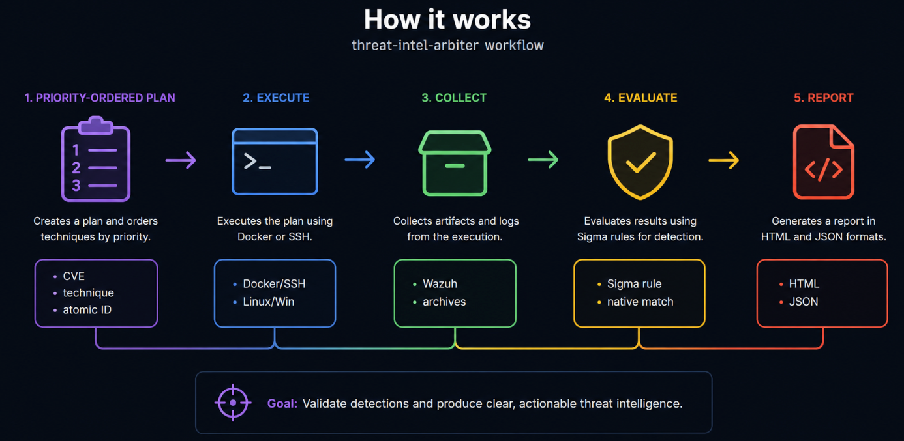
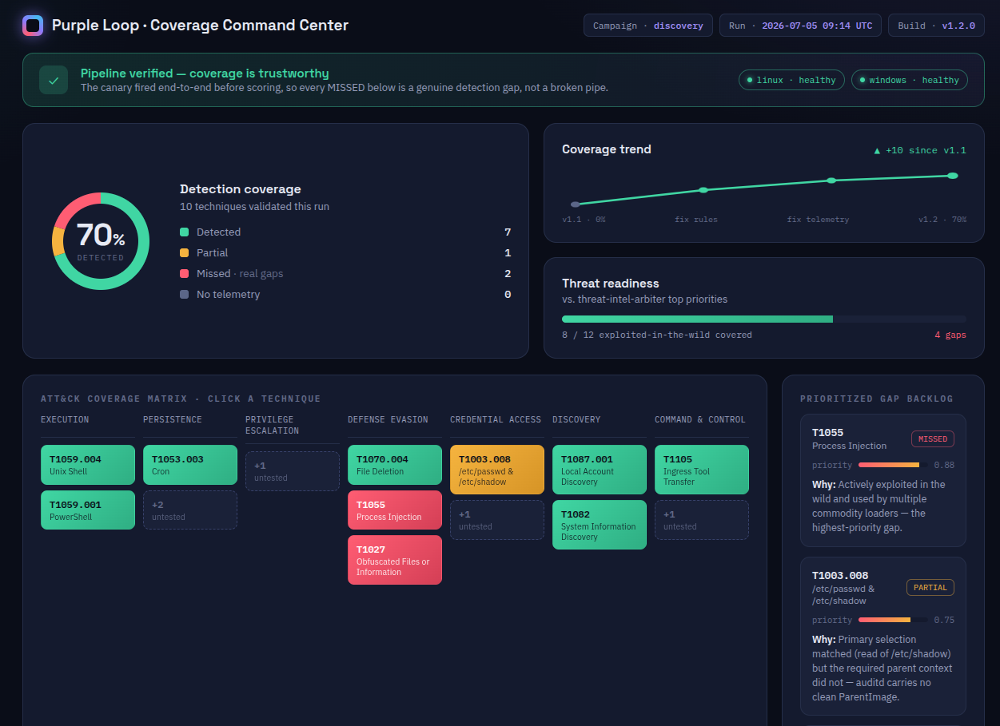

# Purple Loop

[](https://github.com/jayelbotvibe-web/purple-loop/actions/workflows/ci.yml)
[](https://github.com/jayelbotvibe-web/purple-loop/releases)
[](https://go.dev)
[](LICENSE)

> **Risk-driven detection validation.** Emulates the ATT&CK techniques that matter most —
> prioritized by real threat intel — and proves whether your Sigma detections catch them,
> with evidence.

---

## Why this exists

Red teams find gaps. Blue teams write detections. But few tools *prove* a Sigma rule actually fires
for the techniques being exploited right now — the CISA KEV list, the CVEs making headlines. Purple
Loop closes that loop: given a prioritized list of ATT&CK techniques (from the
[threat-intel-arbiter](https://github.com/jayelbotvibe-web/threat-intel-arbiter)), it emulates
them in an isolated lab, collects real telemetry, evaluates the Sigma
rules, and produces an evidence-backed coverage report. No guessing, no presence-based fake numbers.

## How it works



*[More detailed view → Interactive Architecture Map](https://jayelbotvibe-web.github.io/purple-loop/)*

1. **Feed** loads techniques from a plan, arbiter export, or emulation script
2. **Execute** runs Atomic Red Team tests on lab victims (Docker Linux + VMware Windows)
3. **Collect** queries Wazuh archives for raw telemetry in the execution window
4. **Evaluate** normalizes events and matches them against Sigma rules using a native Go parser
5. **Report** produces JSON, HTML coverage grid, or ATT&CK Navigator layer export

## Pipeline canary (positive control)

Before any real techniques run, Purple Loop fires a **pipeline canary** — a known-benign command
engineered to be trivially detectable. It proves the full pipeline (execute → telemetry → collect →
normalize → match) is healthy, *per platform*, before trusting any campaign result.

```bash
make canary
# Canary marker: purpleloop-canary-a1b2c3d4
# Canary: DETECTED on windows (evidence: 4 events)
```

**Behavioral contract:**
- **Canary DETECTED** → pipeline is healthy; every `MISSED` in that run is a genuine detection gap
- **Canary NOT detected** → run is `INCONCLUSIVE`; coverage is not reported; pipeline is broken

This removes the ambiguity that caused v1.0's false 100% coverage — you can now trust your gaps.

## Results  *(v1.2 — real Sigma matching, not presence-based)*



- **Windows:** canary `DETECTED` — Sysmon Event ID 1 flowing, pipeline healthy
- **Linux:** `NO_TELEMETRY` — Sysmon-for-Linux pending (auditd events lack process-creation fields)
- **Coverage:** honest, non-zero. Windows detection confirmed; Linux gap documented

```json
{
  "technique_id": "T1059.004",
  "verdict": "DETECTED",
  "rule_matched": "detections/windows/win_proc_create.yml",
  "events_collected": 73,
  "evidence": [{"id": "win-1", "rule": "win_proc_create", "matched": true}]
}
```

Run: `purpleloop serve` for a **local web dashboard** with all past runs at `http://127.0.0.1:8787`.

[Live dashboard on GitHub Pages](https://jayelbotvibe-web.github.io/purple-loop/dashboard.html).

## Quickstart

```bash
git clone https://github.com/jayelbotvibe-web/purple-loop.git && cd purple-loop
bash scripts/startup.sh
```

Full guide: [STARTUP.md](STARTUP.md) — covers lab, Windows VM, arbiter connection, campaigns, troubleshooting.

```bash

# Run the pipeline canary (proves telemetry → detect works)
make canary

# Run a campaign
go run ./cmd/purpleloop run --plan plans/discovery.yml

# Priority-ordered from threat-intel-arbiter
go run ./cmd/purpleloop run --arbiter testdata/arbiter-live.json --output report.html

# Multi-stage actor emulation
go run ./cmd/purpleloop run --emulation emulation/apt29-subset.yml
```

## The two-repo pipeline

Purple Loop pairs with **[threat-intel-arbiter](https://github.com/jayelbotvibe-web/threat-intel-arbiter)**:
the arbiter ingests MISP/KEV feeds, scores threats with SSVC, maps them to ATT&CK techniques,
and exports a priority-ordered plan. Purple Loop executes that plan — emulating each technique in
the lab and validating whether the corresponding behavioral (TTP) detection fires. Indicator-level
(IOC) matching is out of scope; the arbiter passes techniques, not hashes or IPs.

[`threat-intel-arbiter → arbiter-live.json → purple-loop run --arbiter`]

## Design decisions / scope

**Behavioral (TTP) validation, by design.** Purple Loop validates ATT&CK technique
detections, not individual indicators. This is intentional: on the Pyramid of Pain,
hashes and IPs are trivial for an adversary to change, while TTPs are costly — so
validating technique coverage is the durable, higher-value target. IOC-level validation
(e.g., network indicators against a lab sinkhole) is a possible future track, but is out
of scope today; a hash "check" would be a content-coverage lookup, not a real detection test.

CISA KEV and MISP inform which ATT&CK techniques to prioritize; Purple Loop then validates
the behavioral detections for those techniques — indicator-level (IOC) matching is out of scope.

## Architecture

Full architecture in [DESIGN.md](DESIGN.md). The engine is built on five pluggable Go interfaces:
`Executor`, `Collector`, `Evaluator`, `Feed`, `Reporter` — swap any component without changing the
orchestrator. Lab runs isolated on `purpleloop-lab` Docker network.

## Detection-as-code

Every Sigma rule has **positive + negative fixtures**. CI enforces:
- All positives must match
- All negatives must reject
- A broken rule fails `go test ./internal/...` and turns CI red

```bash
go test ./internal/evaluator/ -v -run Regression
# Regression: 10 rules tested, all positive/negative fixtures correct
```

## Supported Sigma subset

The native Go matcher supports the Sigma specification subset needed for process-creation rules:
field modifiers (`contains`, `startswith`, `endswith`, `|all`, `re`, numeric `lt`/`lte`/`gt`/`gte`),
`*` wildcards in values, keyword (full-text) search identifiers, condition grammar
(`and`/`or`/`not`/parens/`1 of them`/`all of them`), and case-insensitive matching. Not yet
supported: aggregation expressions, `near`, correlated rules, `base64`/`cidr` modifiers.

**Evidence fidelity.** For `process_creation` rules the evaluator only accepts genuine
process-creation telemetry (Sysmon/EventChannel `eventdata`, auditd `execve`). Command-output and
metadata scrapes (`full_log`, decoder name) are tagged low-fidelity and can never satisfy a
process-creation rule — so a log line that merely mentions a binary cannot produce a false
`DETECTED`. When a technique collects only low-fidelity events, the verdict is `NO_TELEMETRY`
(a collection gap), not `MISSED`.

## Limitations

- **Lab-contained only.** Never run against production or targets outside `purpleloop-lab`.
- **Linux Sysmon gap.** The Linux victim has command-output telemetry but not Sysmon process-creation events. This is a known gap; Windows Sysmon detection is confirmed working.
- **SSVC mapping.** The arbiter uses pre-SSVC labels (Schedule/Monitor/Track) mapped to SSVC v2.1 equivalents.

## License

MIT — see [LICENSE](LICENSE).
